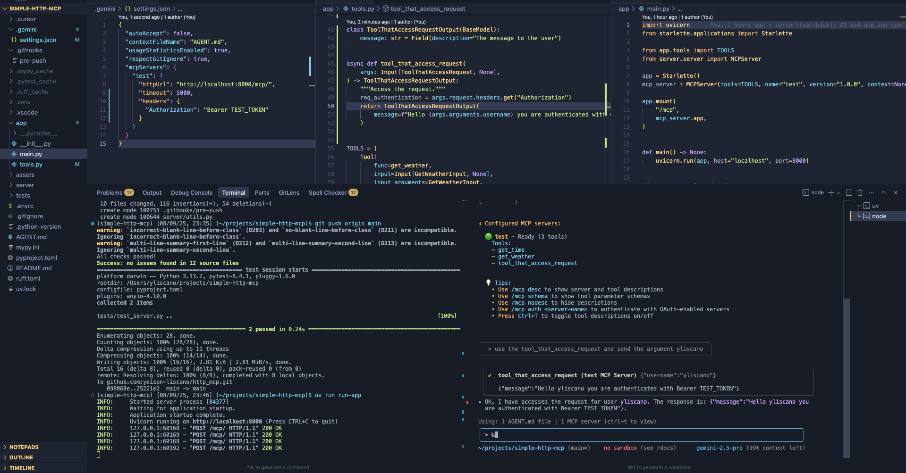

# Simple HTTP MCP Server

This project provides a lightweight server implementation for the Model Context Protocol (MCP) over HTTP. It allows you to expose Python functions as "tools" that can be discovered and executed remotely via a JSON-RPC interface. It is thought to be used with an Starlette or FastAPI application (see [app/main.py](app/main.py)).

<a href="https://glama.ai/mcp/servers/@yeison-liscano/http_mcp">
  
</a>

## How to test with Gemini Cli

1.  **Install dependencies:**
    ```bash
    uv sync
    ```

2.  **Run the server:**
    ```bash
    uv run run-http
    ```
    or for stdio transport:
    ```bash
    uv run run-stdio
    ```

3.  **Test the server:**

    Note: you should be located on the root folder of the project so gemini config is used.

    ```bash
    gemini
    /mcp # This should show the tools available
    ```

Example:



*Note: The example image is not updated with the latest changes.*

## Features

- **MCP Protocol Compliant**: Implements the MCP specification for tool discovery and execution.
- **HTTP and STDIO Transport**: Uses HTTP POST or STDIO for communication (Experimental only testing use).
- **Async Support**: Built on `Starlette` or `FastAPI` for asynchronous request handling.
- **Type-Safe**: Leverages `Pydantic` for robust data validation and serialization.
- **Stateful Context**: Maintain state across tool calls using a context object.
- **Request Access**: Access the incoming request object from your tools.
- **Dependency Management**: Uses `uv` for fast and efficient package management.
- **Linting**: Integrated with `Ruff` for code formatting and linting.
- **Type Checking**: Uses `Mypy` for static type checking.

## Stateful Context

You can use a context object to maintain state across tool calls. The context object is passed to each tool call and can be used to store and retrieve data.

To use a context object, you need to:

1.  **Define a context class:**
    ```python
    from dataclasses import dataclass, field

    @dataclass
    class Context:
        called_tools: list[str] = field(default_factory=list)

        def get_called_tools(self) -> list[str]:
            return self.called_tools

        def add_called_tool(self, tool_name: str) -> None:
            self.called_tools.append(tool_name)
    ```

2.  **Instantiate the context and the server:**
    ```python
    from app.tools import TOOLS, Context
    from server.server import MCPServer

    context = Context(called_tools=[])
    mcp_server = MCPServer(tools=TOOLS, name="test", version="1.0.0", context=context)
    ```

3.  **Access the context in your tools:**
    ```python
    from server.models import Input
    from app.tools import Context

    async def my_tool(args: Input[MyToolArguments, Context]) -> MyToolOutput:
        # Access the context
        args.context.add_called_tool("my_tool")
        ...
    ```

## Accessing the Request

You can access the incoming request object from your tools. The request object is passed to each tool call and can be used to access headers, cookies, and other request data.

```python
from server.models import Input

async def my_tool(args: Input[MyToolArguments, None]) -> MyToolOutput:
    # Access the request
    auth_header = args.request.headers.get("Authorization")
    ...
```

## Getting Started

### Prerequisites

- [uv](https://docs.astral.sh/uv/getting-started/installation/)

### Installation

1.  **Clone the repository:**
    ```bash
    git clone <repository-url>
    cd simple-http-mcp
    ```

2.  **Create a virtual environment and install dependencies:**
    ```bash
    uv venv
    source .venv/bin/activate
    uv sync
    ```

## Usage

For usage examples, please refer to the tests in the `tests/` directory.

## Development

This project uses several tools to ensure code quality.

### Linting

To check for linting errors, run:

```bash
ruff check .
```

To automatically fix linting errors, run:

```bash
ruff check . --fix
```

### Type Checking

To run the static type checker, use:

```bash
mypy .
```